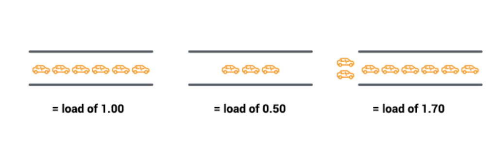
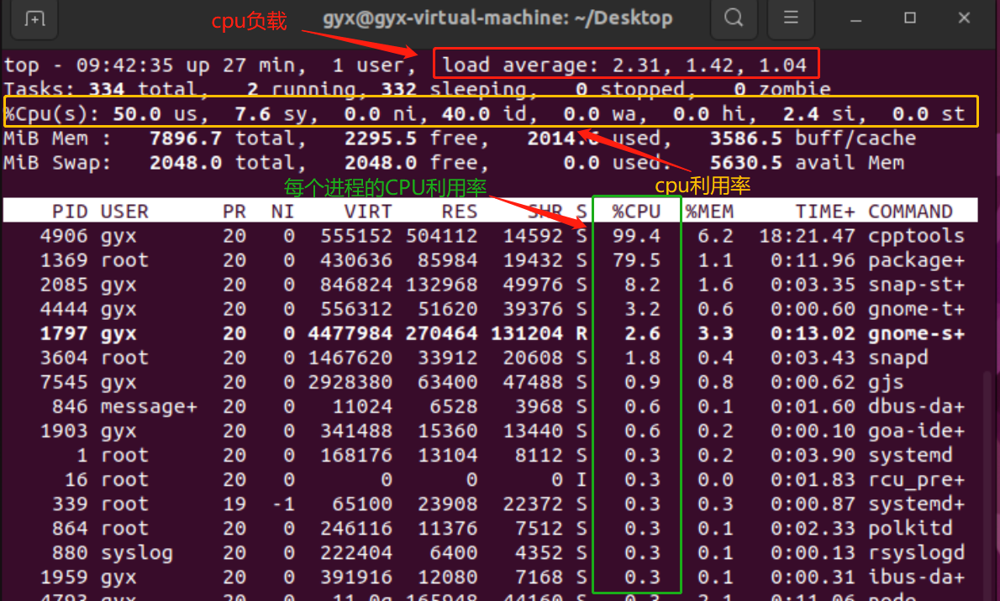
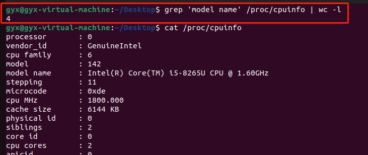
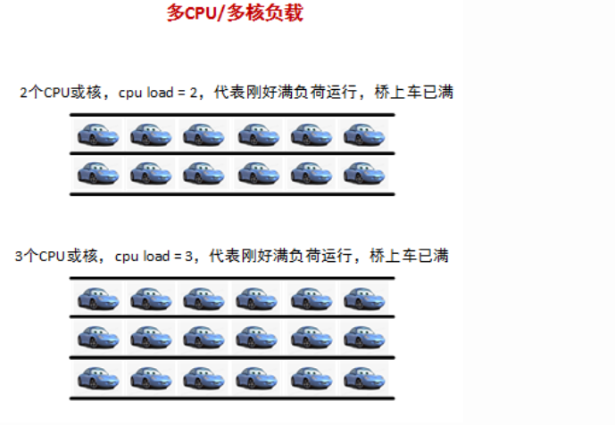
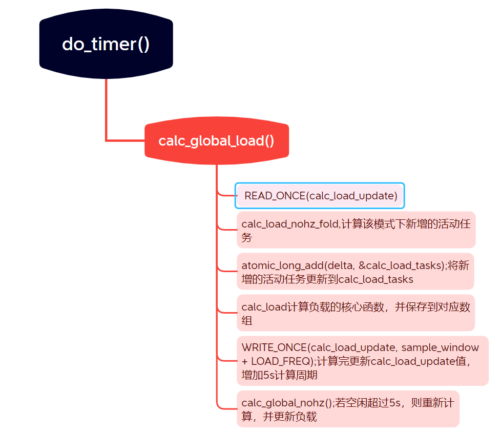

# CPU负载

## 一、基本概念

- CPU负载：CPU负载是指系统中正在运行和等待运行的进程数量，换句话说指的是某个时间点进程对系统产生的压力。负载为1表示系统处于满负荷状态。一般来说，负载是一个三个数字的浮点数，表示在过去1分钟、5分钟和15分钟内的平均负载。运行时间和可运行时间对CPU负载都有贡献。
- CPU利用率：CPU利用率是指 CPU 正在被使用的程度，它反映了 CPU 处理器的忙碌程度。如果 CPU 利用率高，表示 CPU 正在被大量的任务占用，而低的利用率则表示 CPU 空闲或者没有足够的任务需要处理。仅运行时间对于CPU利用率有贡献。

## 二、CPU负载和利用率的关系

### 2.1 含义

如下图所示，“汽车”是使用一段CPU时间 (“过桥”)或者说排队使用 CPU 的进程。 Unix 将此称为运行队列长度，即运行队列长度 =  当前正在运行的进程数 + 等待运行的进程数



如果CPU处理能力处于非饱和状态（如图1和图2），那么所有可运行的进程都能及时获取CPU资源。此时CPU负载等同于CPU利用率，范围是0-100%

但如果CPU处理能力处于过饱和状态（如图3），那么有一部分的可运行进程不能及时获取CPU资源，此时CPU利用率为100%，但CPU负载则超过100%。

在终端输入top命令，结果如下：



负载平均值（load average）的含义: 一分钟、五分钟和十五分钟平均值，并且数字越低越好。

- 对于单核CPU来说，当数值低于1时，表示负载良好，对于CPU的利用率为0-100%，如果负载高于1，则表示CPU利用率100%，但会有可运行的进程在排队。

- 在多处理器系统上，负载与可用处理器核心的数量相关。“100% 利用率”标记在单核系统上为 1.00、在双核系统上为 2.00、在四核系统上为 4.00 。



本机的CPU有4个，核心数为2，因此一共有8个核心。故满负载的话应该为8.00。因此对于上图中，top命令输出的结果，负载都很低。



在上图，当多个CPU或多核时，相当于大桥有多个车道，满负荷运行时cpu_load值为CPU数或多核数。如上图所示，对于2个CPU或核来说，当CPU负载小于等于2时，CPU利用率为0-100%。但如果负载超过2，CPU利用率则为100%。

### 2.2 在系统中查看

- `cat /proc/cpuinfo`：查看CPU信息。
- `cat /proc/loadavg`：查看cpu最近1/5/15分钟的平均负载。
- `grep 'model name' /proc/cpuinfo | wc -l`可以输出CPU的个数，具体每个CPU的核心数参考`/proc/cpuinfo`

### 2.3 小结

- 核心数=最大负载： 在多核系统上，您的负载不应超过可用核心数
- 核心就是核心：核心如何分布在 CPU 上并不重要。两个四核 == 四个双核 == 八个单核。

## 三、计算CPU负载

计算CPU负载，可以让调度器更好的进行负载均衡处理，以便提高系统的运行效率。


### 3.1 基本概念

#### 3.1.1 计算CPU利用率

在`task_struct`结构体中，定义如下：

```c
struct task_struct {
	...
	u64				utime;//进程运行在用户态累积的时间
	u64				stime;//进程运行在内核态累积的时间
	/* Context switch counts: */
	unsigned long			nvcsw;//进程自开始运行发生的主动上下文切换的次数
	unsigned long			nivcsw;//进程自开始运行发生的非主动上下文切换的次数

	/* Monotonic time in nsecs: */
	u64				start_time;//进程的启动时间

	/* Boot based time in nsecs: */
	u64				real_start_time;//程的实际启动时间

	...
};
```

下面的代码是cpu的运行状态，有10种。内核维护了一个每CPU数组kernel_cpustat，里面记录了10种状态的累积时间。

```c
enum cpu_usage_stat {
	CPUTIME_USER,
	CPUTIME_NICE,
	CPUTIME_SYSTEM,
	CPUTIME_SOFTIRQ,
	CPUTIME_IRQ,
	CPUTIME_IDLE,
	CPUTIME_IOWAIT,
	CPUTIME_STEAL,
	CPUTIME_GUEST,
	CPUTIME_GUEST_NICE,
	NR_STATS,
};

struct kernel_cpustat {
	u64 cpustat[NR_STATS];
};

DECLARE_PER_CPU(struct kernel_cpustat, kernel_cpustat);

```

- 用户态

  - `CPUTIME_USER`：普通用户态，对应top的us

  - `CPUTIME_NICE`：降权用户态，对应top的ni

- 系统态
  - `CPUTIME_SYSTEM`：普通系统态，对应top的sy
  - `CPUTIME_SOFTIRQ`：软中断态，对应top的si
  - `CPUTIME_IRQ`：硬中断态，对应top的hi
- 空闲态
  - `CPUTIME_IDLE`：普通空闲态，对应top的id
  - `CPUTIME_IOWAIT`：IO等待态，对应top的wa
- `CPUTIME_STEAL`：偷盗态，对应top的st
- 客户态
  - `CPUTIME_GUEST`：普通客户态，不显示
  - `CPUTIME_GUEST_NICE`：特权客户态，不显示

如果在不启用虚拟机的本征环境下，CPU利用率 = (用户态时间+系统态时间)/(用户态时间+系统态时间+空闲态时间)

#### 3.1.2 CPU负载

top中的CPU负载是粗粒度的负载计算方法：把所有处于可运行状态的(`TASK_RUNNING`)进程数和处于不可中断睡眠态(`TASK_UNINTERRUPTIBLE`)的进程数加起来。也就是活动任务`active task`。上面提到，运行时间和可运行时间对CPU负载都有贡献。即处于可运行状态的进程才对CPU负载有贡献，而不可中断睡眠进程主要对IO负载有贡献，因此top命令反映的是CPU负载和IO负载。

### 3.2 三种计算方式

目前内核中，有以下几种方式来跟踪CPU负载：

1. 全局CPU平均负载；
2. 运行队列CPU负载；
3. `PELT（per entity load tracking）`;

#### 3.2.1 全局CPU平均负载

在`/kernel/sched/loadavg.c`定义如下：

```c
  unsigned long avenrun[3];
/*
 * calc_load - update the avenrun load estimates 10 ticks after the
 * CPUs have updated calc_load_tasks.
 *
 * Called from the global timer code.
 */
void calc_global_load(unsigned long ticks)
{
	unsigned long sample_window;
	long active, delta;

	sample_window = READ_ONCE(calc_load_update);
	if (time_before(jiffies, sample_window + 10))
		return;

	/*
	 * Fold the 'old' NO_HZ-delta to include all NO_HZ CPUs.
	 */
	delta = calc_load_nohz_fold();
	if (delta)
		atomic_long_add(delta, &calc_load_tasks);

	active = atomic_long_read(&calc_load_tasks);
	active = active > 0 ? active * FIXED_1 : 0;

	avenrun[0] = calc_load(avenrun[0], EXP_1, active);
	avenrun[1] = calc_load(avenrun[1], EXP_5, active);
	avenrun[2] = calc_load(avenrun[2], EXP_15, active);

	WRITE_ONCE(calc_load_update, sample_window + LOAD_FREQ);

	/*
	 * In case we went to NO_HZ for multiple LOAD_FREQ intervals
	 * catch up in bulk.
	 */
	calc_global_nohz();
}


```

avenrun[3] 数组包含我们一直在讨论的三个平均值，用于存放最近1/5/15分钟的平均CPU负载。代码的调用流程如下：



calc_load()是完成计算负载的主要代码。如下，这个函数的简要表达为` a1 = a0 * e + a * (1 - e)`。即根据全局变量值avenrun[]的值，来计算新的CPU负载值，并更新avenrun[]

```c
#define FSHIFT		11		/* nr of bits of precision */
#define FIXED_1		(1<<FSHIFT)	/* 1.0 as fixed-point 2^11=2048*/
#define LOAD_FREQ	(5*HZ+1)	/* 5 sec intervals */
#define EXP_1		1884		/* 1/exp(5sec/1min) as fixed-point */
#define EXP_5		2014		/* 1/exp(5sec/5min) */
#define EXP_15		2037		/* 1/exp(5sec/15min) */

/*
 * a1 = a0 * e + a * (1 - e)
 */
static inline unsigned long
calc_load(unsigned long load, unsigned long exp, unsigned long active)
{
	unsigned long newload;
	//cpuload计算公式：load值为旧的CPU负载值avenrun[]
	newload = load * exp + active * (FIXED_1 - exp);
     // 如果活跃值大于等于当前负载值，则将新负载值加1
	if (active >= load)
		newload += FIXED_1-1;

	return newload / FIXED_1;
}
```

#### 3.2.2 运行队列CPU负载

Linux5.3版本以前，也就是在引入PELT机制之前，一个CPU的负载就是其运行队列上所有调度实体的负荷权重总和，CPU负载是跟据rq中的cpu_load[]数组

```c
struct rq {
	unsigned int		nr_running;

	#define CPU_LOAD_IDX_MAX 5
	unsigned long		cpu_load[CPU_LOAD_IDX_MAX];
	...
	}
```

该数组一共有5个，每个时钟节拍更新一次。其中cpu_load[0]表示当前节拍的cpu负载。cpu_load[1]表示上一个节拍的cpu负载，依次类推。

在内核启动阶段，每个cpu的cpu_load数组会被初始化为0，在运行过程中，一般每个时钟节拍都会在scheduler_tick中通过__update_cpu_load更新cpu_load数组。在更新时

- `cpu_load[0] = cfs运行队列中可运行进程贡献的平均cpu负载`
- `cpu_load[1] = (cpu_load[1]+cpu_load[0])/2`
- `cpu_load[2]=(cpu_load[2]*3+cpu_load[0])/4`
- `cpu_load[3]=(cpu_load[3]*7+cpu_load[0])/8`
- `cpu_load[4]=(cpu_load[4]*15+cpu_load[0])/16`

#### 3.2.3 PELT

在引入`PELT`之后，通过跟踪每个调度实体的负载贡献来计算。（其中，`调度实体：指task或task_group`）,会同时考虑调度实体的CPU利用率及负荷权重。

**基本原理如下**：

设置1024us为观察周期，统计每个调度实体在一个周期内的CPU使用状况，此处统计的是调度实体处于task_running的状态。这个CPU使用状况就是在一个观察周期内的原始CPU负载。

平均负载`L = L0+L1 * y +L2 * y^2 +L3 * y^4.....`，其中L0是当前周期负载，L1是上一个周期负载，依次类推，y是衰减因子，每隔一个周期1024us就乘以y来衰减一次

在内核中，PELT使用的主要数据结构为CPU负载因子`struct sched_avg`

```c
struct sched_avg {
	u64				last_update_time;//上一次负载更新的时间，主要用于计算时间差
	u64				load_sum;//实体的整个可运行时间总和(等待调度时间和正在运行时间)
	u64				runnable_load_sum;//CPU负载因子的load_sum仅由可运行进程贡献的部分
	u32				util_sum;//统计实体真正运行的时间
	u32				period_contrib;
	unsigned long			load_avg;//实体的可运行时间的平均cpu负载
	unsigned long			runnable_load_avg;//CPU负载因子的load_avg仅由可运行进程贡献的部分
	unsigned long			util_avg;//实体的正在运行时间的平均cpu负载，只考虑调度实体真正的运行时间
	struct util_est			util_est;
} ____cacheline_aligned;
```